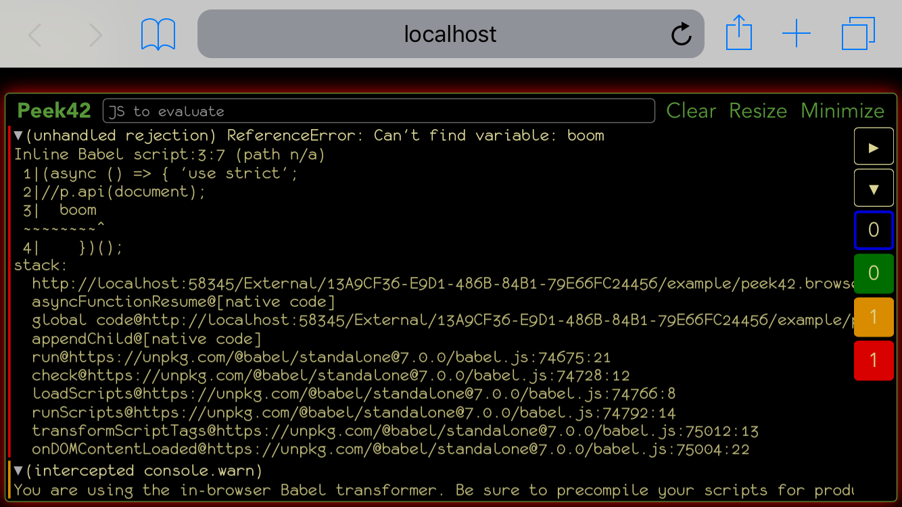

# Peek42

Touch based browser console




## [Demo](https://rpeev.github.io/peek42/)

## Distribution

### Unpkg - [https://unpkg.com/peek42@latest/dist/](https://unpkg.com/peek42@latest/dist/)

- Node module (CJS) - [https://unpkg.com/peek42@latest/dist/peek42.node.js](https://unpkg.com/peek42@latest/dist/peek42.node.js) (tiny wrapper over `console.log`)
- Browser bundle (UMD) - [https://unpkg.com/peek42@latest/dist/peek42.browser.js](https://unpkg.com/peek42@latest/dist/peek42.browser.js)
- Node ES module - [https://unpkg.com/peek42@latest/dist/peek42.node.mjs](https://unpkg.com/peek42@latest/dist/peek42.node.mjs)
- Bundlers/browsers ES module - [https://unpkg.com/peek42@latest/dist/peek42.browser.mjs](https://unpkg.com/peek42@latest/dist/peek42.browser.mjs)
- Monofur font ([LICENCE_Monofur](https://unpkg.com/peek42@latest/LICENCE_Monofur)) - [https://unpkg.com/peek42@latest/dist/monofur.woff](https://unpkg.com/peek42@latest/dist/monofur.woff)
- Main style - [https://unpkg.com/peek42@latest/dist/peek42.css](https://unpkg.com/peek42@latest/dist/peek42.css)
- Dark theme - [https://unpkg.com/peek42@latest/dist/peek42-dark.css](https://unpkg.com/peek42@latest/dist/peek42-dark.css)
- Bookmarklet - [https://unpkg.com/peek42@latest/dist/peek42.bookmarklet.unpkg.js](https://unpkg.com/peek42@latest/dist/peek42.bookmarklet.unpkg.js)

## Install

(See [ApiVis](https://github.com/rpeev/apivis) for installing **apivis.js**)

### Node

(`apivis` is optional)

```bash
npm install apivis
npm install peek42
```

All distribution files are in `node_modules/peek42/dist/`

### Browser

(`monofur.woff` is expected to be next to `peek42.css`, `peek42-dark.css` and `apivis.browser.js` are optional)

```html
<link rel="stylesheet" href="https://unpkg.com/peek42@latest/dist/peek42.css" />
<link rel="stylesheet" href="https://unpkg.com/peek42@latest/dist/peek42-dark.css" />

<script src="https://unpkg.com/apivis@latest/dist/apivis.browser.js"></script>
<script src="https://unpkg.com/peek42@latest/dist/peek42.browser.js"></script>
```

### Bookmarklet

Bookmark a webpage (any will do). Then change the title to your liking and the url **to the contents** of [peek42.bookmarklet.unpkg.js](https://unpkg.com/peek42@latest/dist/peek42.bookmarklet.unpkg.js)

## Use

### Node

```javascript
const apivis = require('apivis');
const peek42 = require('peek42');
  const {p, pp} = peek42.use(apivis);

p.api(process);
```

### Browser

```javascript
const {p, pp} = peek42.use(apivis);

document.addEventListener('DOMContentLoaded', () => {
  p.api(document);
});
```

### ES module

```javascript
// Node
import apivis from 'apivis';
import peek42, {p, pp} from 'peek42/dist/peek42.node';
  peek42.use(apivis);

// Bundlers
import apivis from 'apivis';
import peek42, {p, pp} from 'peek42';
  peek42.use(apivis);

// Use the imports
```

## API

The following properties/functions are available through the **peek42** namespace object returned from `require('peek42')` on node or available as `window.peek42` in the browser (the ES module has the namespace object as default export and `p`, `pp` and `pretty` as named exports):

- `version` - library version
- `p(val[, comment[, opts]])` - **p**rint `val`ue with optional `comment` (`undefined` and `''` cause default comment to be generated, `null` means no comment), `opts` can be used to specify the log level - `{level: 'info'}` for example, the default is `{level: 'log'}`, the other possibilities are `'info'`, `'warn'` and `'error'`. If [ApiVis](https://github.com/rpeev/apivis) is installed and `peek42.use(apivis)` executed, `p` itself gains the following methods:
    - `p.type(val[, comment[, opts]])`
    - `p.desc(val, k[, comment[, opts]])`
    - `p.members(val[, comment[, opts]])`
    - `p.chain(val[, comment[, opts]])`
    - `p.api(val[, comment[, opts]])`

    The mandatory parameters mirror those of the corresponding `apivis.xxxStr` functions. `comment` and `opts` are the same as with `p`. `p.members`, `p.chain` and `p.api` accept `{indent: 'string'}` as additional option and `p.members` accepts `{indentLevel: 'number'}` as another aditional option
- `pp(val[, comment[, opts]])` - **p**retty **p**rint `val`ue - same as `p` but uses `JSON.stringify` (handling circular references)

    `p` and `pp` are meant to be the primary library interface (do a suitable assignment or import as per the use examples)
- `pretty(val)` - prettified value as printed by `pp` as a string
- `use(lib)` - register **peek42** plugin
- `Console` (browser only, advanced usage) - the `console` class, use its `instance` static getter (returns `Promise`) to safely obtain reference to initialized `console` outside of `document` `ready` blocks

    ```javascript
    Console.instance.then(console => {
      // Use console
    });

    // or using async/await

    let console = await Console.instance;

    // Use console
    ```
- `console` (browser only, advanced usage) - the `console` instance, use its methods (after making sure it is initialized either via `Console.instance` wait or in `document` `ready` block) to drive it through code (use `p.api(peek42.console)` to find out the API)

**peek42** intercepts the native console logging function calls, so `console.log` calls (for example) will show up

**peek42** listens for JavaScript errors (including `unhandledrejection` of promises) and shows them with the error message as a comment and the stack trace if present

## UI

If no log function has been called, **peek42** is shown minimized. Tap **Show** to show it. By default, whenever a log function is called, **peek42** is shown and the log is scrolled to the top (entries are logged from oldest at the bottom to newest at the top), so that the latest entry is visible. Tap **Minimize** to minimize it. This can be changed by turning on the **Quiet** checkbox (visible only when **peek42** is minimized). In this mode, **peek42** flashes on log write, but stays minimized. Tapping the title alternates the log position between start/end. Use **Resize** to resize **peek42** (**peek42** limits its dimensions and the border briefly flashes upon reaching the limits) and **Clear** to clear the log contents

Use the text box **JS to evaluate** to eval JavaScript code (write in the box and simply hit enter). Print functions can be specified by prefixing the expression with one of `v(alue)` (the default), `p(retty)`, `t(ype)`, `d(esc)` (requires two arguments separated by a comma), `m(embers)`, `c(hain)`, `a(pi)`. Only `v(alue)` and `p(retty)` are supported out of the box, the others require [ApiVis](https://github.com/rpeev/apivis)

See the **example** folder for node and browser examples respectively
