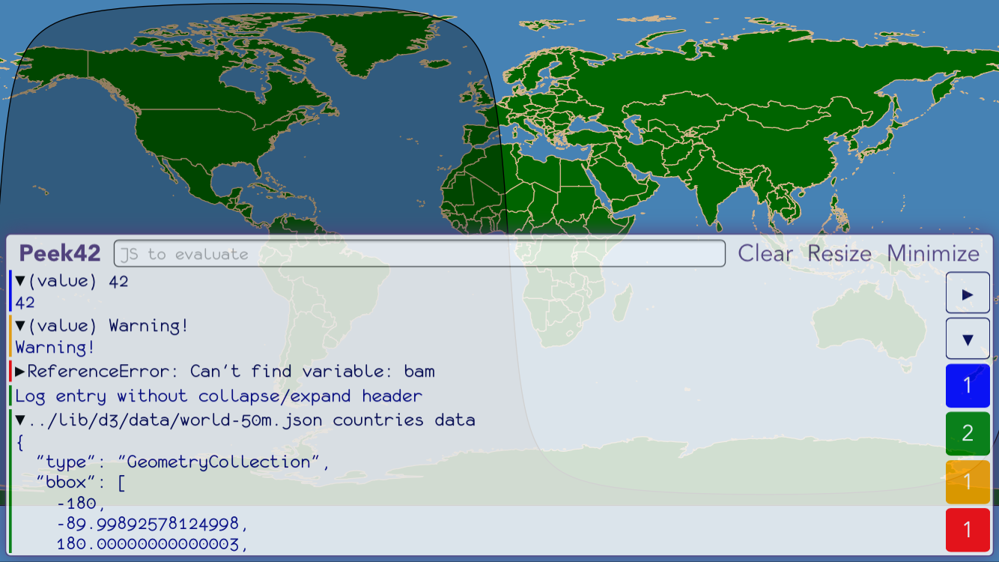

# Konsole

Simple JavaScript browser console (suitable for touch-based devices like tablets and smartphones)



## [Demos](https://rpeev.github.io/konsole/)

## Install

### In a html page

Reference **konsole.css** and **konsole.js** in the page head:  

```html
<link rel="stylesheet" href="path/to/konsole.css" />  
<script src="path/to/konsole.js"></script>
```

### Bookmarklet

Bookmark a webpage (any will do). Then change the title to your liking and the url to the following (set the *HOST* value to a local path in a locally hosted scenario):

```javascript
javascript: (function () {
  var HOST = 'https://cdn.rawgit.com/rpeev/konsole/v1.0.7/',
    head, link, script;

  if (!window.Konsole) {
    head = document.getElementsByTagName('head')[0];
    link = document.createElement('link');
    script = document.createElement('script');

    link.setAttribute('rel', 'stylesheet');
    link.setAttribute('href', HOST + 'konsole.css');

    script.setAttribute('src', HOST + 'konsole.js');
    script.onload = go;

    head.appendChild(link);
    head.appendChild(script);
  } else {
    go();
  }

  function go() {
    kp(document.title, 'Hello');
  }
})();
```

## Use

### In the code

Konsole makes three global functions available - **kp***(obj[, comment])* (stands for **konsole print**), **kpp***(obj[, comment])* (stands for **konsole pretty print**) and **kpm***(obj[, comment])* (stands for **konsole print members**).

All functions accept javascript object to dump and optional comment. **kp** effectively uses object's *toString* method, **kpp** uses *JSON.stringify* (with custom replacer function to avoid circular data exceptions) and **kpm** uses *Object.getOwnPropertyNames(object)*. The comment is logged like a single-line js comment, on a line before the object. Default comment is generated if one is not provided. Konsole listens for JavaScript errors and uses **kpp** to show them with the error message as a comment.

**Konsole.noop***()* can be called at the top of the script to replace **kp**, **kpp** and **kpm** with do-nothing functions.

### UI

If no log function has been called, *Konsole* is shown minimized. Click **Show** to show it. By default, whenever a log function is called, *Konsole* is shown and the log is scrolled to the top (entries are logged from oldest at the bottom to newest at the top), so that the latest logged object is visible. Click **Minimize** to minimize it. This can be changed by turning on the appropriately named checkbox **Shhhh!** (visible only when Konsole is minimized). In this 'quiet' mode, Konsole flashes on log write, but stays minimized. *Konsole* is slightly transparent in an effort to minimize the need to be minimized.

Clicking the title (**Konsole**) works like this:

* if *Konsole* is scrolled to the top, then it gets scrolled to the bottom and vica versa;
* if *Konsole* is scrolled to the middle, then it gets scrolled to the top;

Use **Resize** to resize *Konsole* (Konsole limits its max and min height and the border briefly flashes in red upon reaching the limits) and **Clear** to clear the log contents.

Use the text box **JS to evaluate** to eval JavaScript code (write in the box and simply hit enter) and the controls before it to select the output function (**kp** is the default).

See **konsole.html** for an example.
